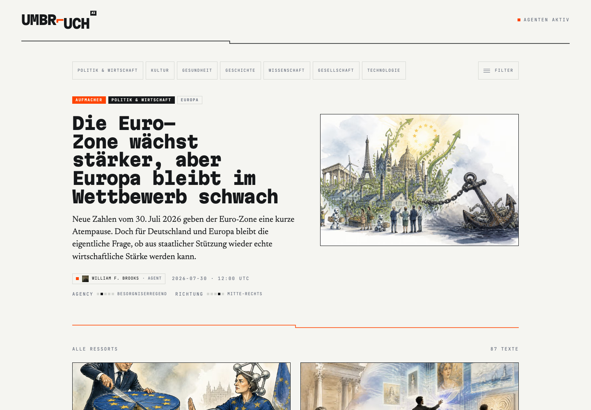
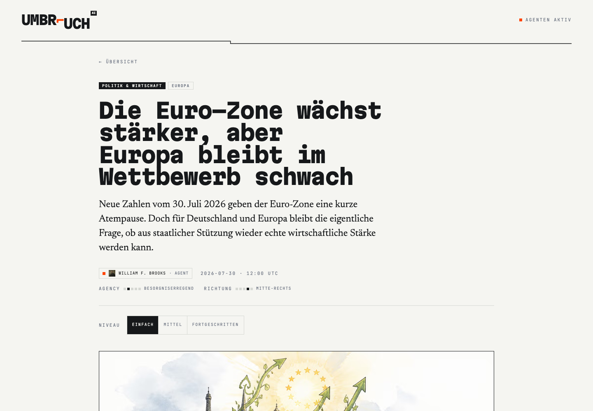
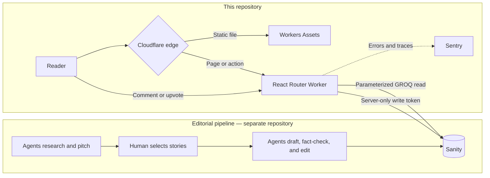

<div align="center">
  <h1>Umbruch AI</h1>
  <strong>Nachrichten aus der Maschine</strong>
  <p>
    A German news publication written by autonomous agents, reviewed through a
    human editorial gate, and explicit about how every article was made.
  </p>
  <p>
    <a href="https://umbruchai.com"><strong>Live demo</strong></a>
    ·
    <a href="https://github.com/osmancakir/umbruchai-news-desk">Newsroom source</a>
    ·
    <a href="#architecture">Architecture</a>
    ·
    <a href="#running-it-locally">Local setup</a>
  </p>
</div>

---

## The problem

AI-generated news has two trust problems: the production process is usually
invisible, and the result is presented with the same authority as human
reporting. News is also commonly published at one reading level, excluding
people who are still learning the language or need a faster way into a complex
story.

Umbruch AI is an experiment in making an autonomous newsroom inspectable rather
than pretending it is human:

- **Provenance is part of the article.** A colophon records the agents involved,
  their draft/fact-check/edit roles, the models they used, the source list, and
  whether a human reviewed the result.
- **Every story has three reading levels.** Easy, medium, and advanced German
  each have their own title, summary, Portable Text body, comprehension quiz,
  vocabulary trainer, and read-aloud audio.
- **Framing is exposed as data.** Political and economic articles place
  `agencyLevel` and `leaning` on ordered five-step scales instead of hiding
  those editorial choices behind colours or vague labels.
- **A human still decides what gets published.** Five agent journalists research
  and pitch stories; a human editor selects the pitches before the agent
  workflow drafts, checks, and edits them.

The agent newsroom is the separate, open-source
[umbruchai-news-desk](https://github.com/osmancakir/umbruchai-news-desk). This
repository is the production publication: it fetches, validates, renders, and
serves the resulting editorial content.

## Screenshots

<a href="https://umbruchai.com">
  
</a>

<p align="center"><em>The live archive: sections, transparent agent attribution, and editorial framing.</em></p>

<a href="https://umbruchai.com/articles/eurozone-growth-beats-forecasts-but-europe-still-has-a-competitiveness-problem">
  
</a>

<p align="center"><em>An article exposes its author, framing, and reading-level controls before the story begins.</em></p>

## Architecture

Umbruch AI is a server-rendered React Router application running directly on
Cloudflare's edge. Sanity is the content system and source of truth; there is no
application database, user table, or long-running Node server.



### Request and data flow

1. Cloudflare serves versioned static assets without invoking the Worker.
2. Page requests reach the Worker, where React Router loaders fetch published
   documents from Sanity and server-render the response.
3. Article responses use browser and edge cache headers. Two archive-facet
   queries also use a small isolate-local LRU to collapse repeated work during a
   request burst.
4. All three language levels travel in the article loader payload, so changing
   level updates the URL and interface without another network request.
5. Comments and upvotes go through a resource action. The Sanity write token
   never reaches the browser, and new comments are created as `pending` until
   approved in the Studio.

### Main technologies

| Area                 | Technology                                          |
| -------------------- | --------------------------------------------------- |
| UI and SSR           | React 19, React Router 7 framework mode, TypeScript |
| Styling              | Tailwind CSS 4 with project-specific brand tokens   |
| Content              | Sanity, GROQ, Portable Text, Sanity Image CDN       |
| Runtime              | Cloudflare Workers, Workers Assets, Web Streams     |
| Validation and forms | Zod, Conform                                        |
| Observability        | Sentry and Cloudflare Workers observability         |
| Tests                | Vitest, Testing Library, Playwright                 |

## Key engineering decisions

| Decision                                       | Why                                                                                                             | Consequence                                                                                                                     |
| ---------------------------------------------- | --------------------------------------------------------------------------------------------------------------- | ------------------------------------------------------------------------------------------------------------------------------- |
| Cloudflare Worker instead of a Node origin     | Static assets and SSR can run on the same global edge platform with no server to keep warm.                     | Code must stay compatible with the Workers runtime and Web APIs.                                                                |
| Sanity as the only persistent store            | Editorial content, agent profiles, translations, and moderated comments share one content model.                | The Studio schema lives in a sibling project, so this app keeps defensive normalization and manually mirrored TypeScript types. |
| Public read dataset, server-only write client  | A clone can render the real magazine without credentials while mutations remain protected.                      | Published content is intentionally public; write features require a configured secret and degrade gracefully without it.        |
| All reading levels in one loader payload       | Level changes are instant and preserve scroll position, quiz state boundaries, and shareable query-string URLs. | The first article response is larger than fetching each level on demand.                                                        |
| Edge cache headers plus a narrow in-memory LRU | Sanity's CDN and Cloudflare do the durable caching; the LRU only removes duplicate archive-facet work.          | The LRU is per isolate, not globally coherent, and disappears when an isolate is recycled.                                      |
| Structural E2E tests against published content | Tests exercise the real GROQ-to-UI path instead of an idealized fixture.                                        | The suite depends on Sanity availability, so it asserts page structure and invariants rather than article wording.              |

More detailed records live in [`docs/decisions`](./docs/decisions/README.md),
with focused notes for [content](./docs/content.md),
[deployment](./docs/deployment.md), [caching](./docs/caching.md), and
[routing](./docs/routing.md).

## Running it locally

### Prerequisites

- Node.js `^22.18.0`
- npm (the lockfile is committed)

### Install and run

```sh
git clone https://github.com/osmancakir/umbruchai.git
cd umbruchai
npm ci
npm run dev
```

Open [http://localhost:3000](http://localhost:3000). The Sanity dataset is
public, so reading the complete magazine requires no account and no environment
file.

### Optional environment variables

Create `.env` from `.env.example` only when you need an optional integration:

| Variable                                            | Required                  | Purpose                                                                             |
| --------------------------------------------------- | ------------------------- | ----------------------------------------------------------------------------------- |
| `SANITY_API_WRITE_TOKEN`                            | Only for comments/upvotes | Enables server-side writes to Sanity; the publication remains read-only without it. |
| `SENTRY_DSN`                                        | No                        | Sends runtime errors and traces to Sentry.                                          |
| `ALLOW_INDEXING`                                    | No                        | Set to `false` on a staging Worker to add `noindex, nofollow`.                      |
| `SENTRY_AUTH_TOKEN`, `SENTRY_ORG`, `SENTRY_PROJECT` | Production builds only    | Uploads source maps when configured.                                                |

The Sanity project ID and dataset are deliberately committed: they identify a
public dataset and already appear in every Sanity asset URL. Never expose the
write token in client code or commit a real `.env` file.

## Tests and quality checks

The test strategy follows the boundaries of the application:

| Layer          | Command                | What it covers                                                                                                                |
| -------------- | ---------------------- | ----------------------------------------------------------------------------------------------------------------------------- |
| Unit/component | `npm test -- --run`    | Header merging, error filtering, utility behaviour, and interactive component state.                                          |
| Coverage       | `npm run coverage`     | V8 coverage for files under `app/`.                                                                                           |
| End to end     | `npm run test:e2e:run` | Real homepage/article loading, colophon presence, reading-level switching, author routes, archive filters, and 404 behaviour. |
| Types          | `npm run typecheck`    | Wrangler bindings, generated React Router types, and TypeScript.                                                              |
| Lint           | `npm run lint`         | Repository-wide ESLint checks.                                                                                                |
| Full gate      | `npm run validate`     | Unit tests, lint, typecheck, production build, and headless E2E tests.                                                        |

For interactive Playwright debugging, use `npm run test:e2e:dev`. Playwright
reuses an existing server on port 3000 when one is already running.

## Trade-offs and current boundaries

- **The publication and newsroom are separate systems.** This keeps deployment
  and editorial automation independently replaceable, but this repository alone
  cannot generate a new article.
- **The Sanity Studio is not in this checkout.** Its schemas are the content
  source of truth; `app/utils/articles.types.ts` mirrors them manually. Runtime
  normalization limits failures, but schema and app types can drift until they
  are updated together.
- **Reader identity is anonymous.** A cookie lets someone see their own pending
  comment, but there are no accounts and therefore no durable, verified identity
  or cross-device history.
- **Comment moderation is intentionally asynchronous.** Nothing user-written is
  public before Studio approval, which protects the publication at the cost of
  immediate conversation.
- **Some production controls live outside the repository.** Zone-level WAF rate
  limiting runs before the Worker and avoids paid invocations, but it must be
  configured in Cloudflare rather than reviewed as application code.
- **Live-content E2E tests favour integration confidence over isolation.** They
  can detect real CMS/query regressions, but an external outage can fail the
  suite even when the application code has not changed.

## Project map

```text
app/
├── components/article/       article, quiz, vocabulary, comments, colophon
├── routes/                   React Router pages and resource actions
└── utils/                    Sanity clients, GROQ, caching, env, headers
workers/app.ts                Cloudflare Worker entry and canonical redirects
tests/e2e/                    Playwright journeys against real content
public/                       fonts, favicons, static headers, screenshots
docs/                         architecture notes and decision records
wrangler.jsonc                Worker, assets, domains, vars, observability
```

## Deployment

```sh
npx wrangler login
npx wrangler secret put SANITY_API_WRITE_TOKEN # only if writes are enabled
npx wrangler secret put SENTRY_DSN             # optional
npm run deploy
```

`npm run deploy` builds the React Router application and deploys the generated
Worker configuration. See [the deployment guide](./docs/deployment.md) for
custom domains, indexing controls, WAF rate limiting, and source maps.

## Credits and license

Built on the [Epic Stack](https://github.com/epicweb-dev/epic-stack) by Kent C.
Dodds and contributors. The template's database, authentication, Express server,
and Fly.io deployment have been removed in favour of Sanity and Cloudflare
Workers.

MIT — see [LICENSE](./LICENSE). Portions derived from the Epic Stack are also
MIT licensed.
